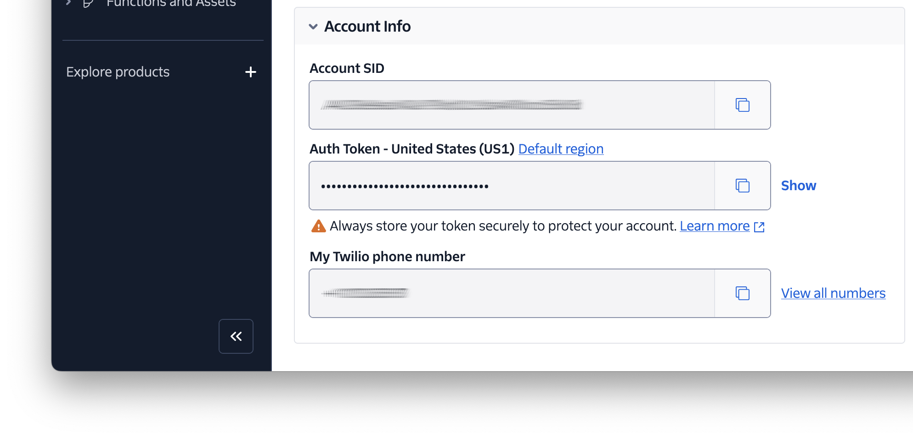
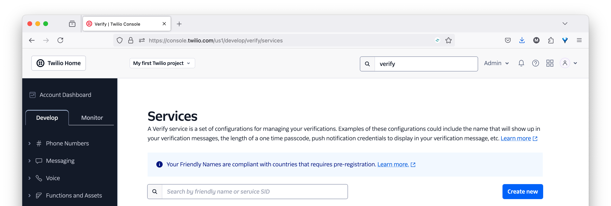
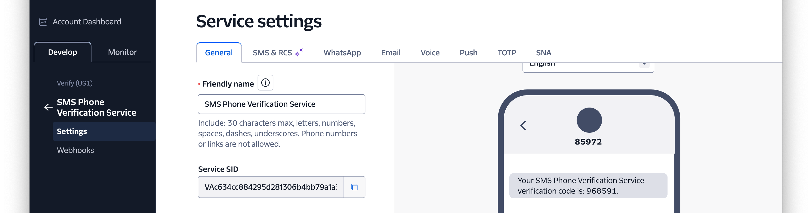
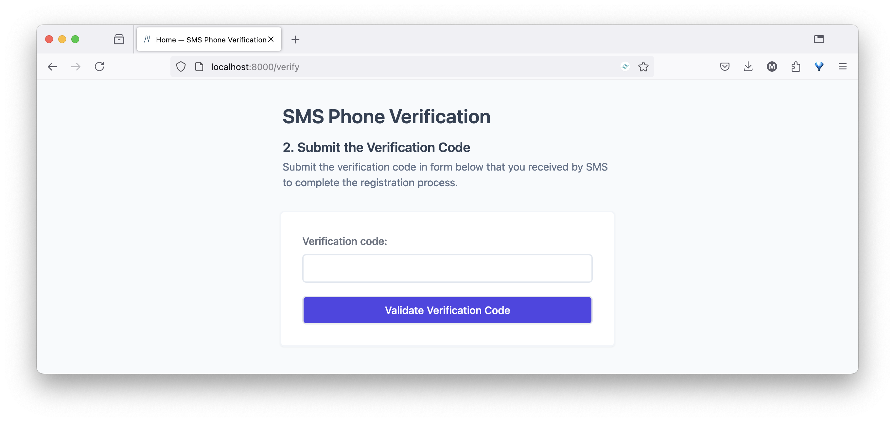
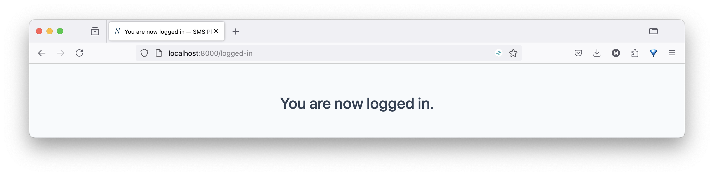

# SMS Phone Verification in Go

This is a small Go app that shows how to perform SMS phone verification.

Find out more on [Twilio Code Exchange][code-exchange-url].

## Application Overview

It uses [Twilio Verify][twilio-verify-url] to verify phone numbers and add an additional layer of security, helping prevent fraudulent users from registering with your business.

It steps users through the process of creating an account on a (fictional) website; specifically:

1. The user needs to enter a username, password, and phone number in the initial step and submit the form.
1. Then, the customer is sent an SMS with a verification code for 2-Factor Authentication (2FA), and redirected to the second step in the process where they will be asked to enter a verification code into the webpage to verify their account.
1. The verification code is then validated against the Twilio Verify service.
  If the code is valid, the user is then redirected to the logged in page, indicating that they have successfully registered with the application.
  If the code is not valid, the user is redirected back to the verify step, where an error is displayed, showing that verification failed.

## Requirements

To use the application, you'll need the following:

- [Go][go-download-url] 1.22 or above
- A Twilio account (free or paid) with a phone number. [Click here to create one][twilio-referral-url], if you don't have one.
- A phone number that can received SMS
- Your web browser of choice

## Getting Started

After cloning the code to where you store your Go projects, and change into the project directory.
Then, copy _.env.example_ as _.env_, by running the following command:

```bash
cp -v .env.example .env
```

After that, set values for `TWILIO_ACCOUNT_SID`, `TWILIO_AUTH_TOKEN`, `TWILIO_PHONE_NUMBER`.
You can retrieve these details from the **Account Info** panel of your [Twilio Console][twilio-console-url] dashboard.



### Create a Verify Service

Following that, create a Verify V2 service.



First, open [the Twilio Console][twilio-console-url] in your browser of choice and navigate to **Explore products > Verify >** [Services][twilio-console-verify-services-url].
There, click **Create new**.


In the **_Create new_** (Verify Service) form that appears, provide a **Friendly name**, enable the **SMS** verification channel, and click **Continue**.


Following that, click **Continue** in the **Enable Fraud Guard** stage.



Now, you'll be on the **Service** settings page for your new Verify Service.
Copy the **Service SID** and set it as the value of `TWILIO_VERIFICATION_SID` in _.env_.

### Launch the Application

When that's done, run the following command to start the application:

```php
go run main.go
```

With the application ready to go, open <http://localhost:8000> in your browser of choice.
There, you'll see the form where you can request a verification code. 


Enter your username, password, and phone number and submit the form.
Then, you'll see a form which you can validate the verification code.



Enter the verification code that you should have received via SMS and submit the form.
You will now be "authenticated" with the application, and on the logged in page.



There is no explicit log out functionality. 
To do that, you'll have to clear the cookies for localhost using your browser's settings tooling.

## Contributing

If you want to contribute to the project, whether you have found issues with it or just want to improve it, here's how:

- [Issues][github-issues-url]: ask questions and submit your feature requests, bug reports, etc
- [Pull requests][github-pr-url]: send your improvements

## Resources

Find out more about the project on [CodeExchange][code-exchange-url].

## Did You Find The Project Useful?

If the project was useful and you want to say thank you and/or support its active development, here's how:

- Add a GitHub Star to the project
- Write an interesting article about the project wherever you blog

[code-exchange-url]: https://www.twilio.com/code-exchange/sms-phone-verification
[go-download-url]: https://go.dev/doc/install
[twilio-console-url]: https://console.twilio.com/
[twilio-referral-url]: http://www.twilio.com/referral/QlBtVJ
[twilio-verify-url]: https://www.twilio.com/docs/verify
[github-issues-url]: https://github.com/settermjd/sms-phone-verification-go/issues
[github-pr-url]: https://github.com/settermjd/sms-phone-verification-go/pulls
[twilio-console-verify-services-url]: https://console.twilio.com/us1/develop/verify/services
